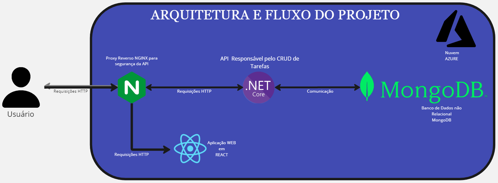

# Descrição
O projeto tem como objetivo resolver um problema de gerenciamento de tarefas dentro de alguns times da DimDim, na qual o sistema de Kanban em nuvem utilizado por esses times ultimamente tem ficado constantemente instável o que gerou constantes problemas de orquestração de tarefas nos times, causando duplicações e atrasos nas entregas das tarefas durantes as sprints.
Para resolver esse problema, será desenvolvido um sistema de gerenciamento de tarefas para uso interno temporário, portanto sem muita complexidade como um sistema de login por exemplo, que será executada na nuvem pública Azure e contará com:
        1 - [API em .NET para o CRUD de tarefas (Criar, Recuperar, Atualizar, Deletar)](./WEBAPI/TaskManager/README.md)
        2 - [PROJETO WEB para servir de mural onde será visualizado os cards das tarefas existentes](./WEBAPP/task-viewer/README.md)
        3 - MongoDB para persistência dos dados necessários para o funcionamento

---
		
# Arquitetura:

---

# Intruções

Para utilizar o projeto, faça o clone do projeto abrindo o terminal na pasta que deseja que o projeto seja copiado e executando o seguinte comando:

    git clone https://github.com/Inoxybel/CP2-DevOps-3Sem.git

Após clonar o repositório, você irá precisar das seguintes dependências instaladas:

#### - Para rodar as aplicações direto em um container Docker:
    Docker Desktop:
    
    Siga as intruções abaixo de acorco com seu sistema para instalar:

    Windows: https://docs.docker.com/desktop/install/windows-install/

    Linux: https://docs.docker.com/desktop/install/linux-install/

    Mac: https://docs.docker.com/desktop/install/mac-install/

    Para mais informações olhe a documentação oficial do Docker no link: https://docs.docker.com/desktop/

    Com o docker desktop instalado e em execução na máquina, abra o terminal no diretório raíz do projeto (o que possui o arquivo docker-compose.yml) e execute o comando:

        docker-compose up -d

    Aguarde todo projeto ser configurado e executado, e você poderá acessar a aplicação WEB pelo link: 

        http://localhost

    A projeto nesse ponto já está pronta para uso.

    Note que em ambos containers dos projetos (WEB e API) a aplicação está em seu diretório padrão definido como /app

---
